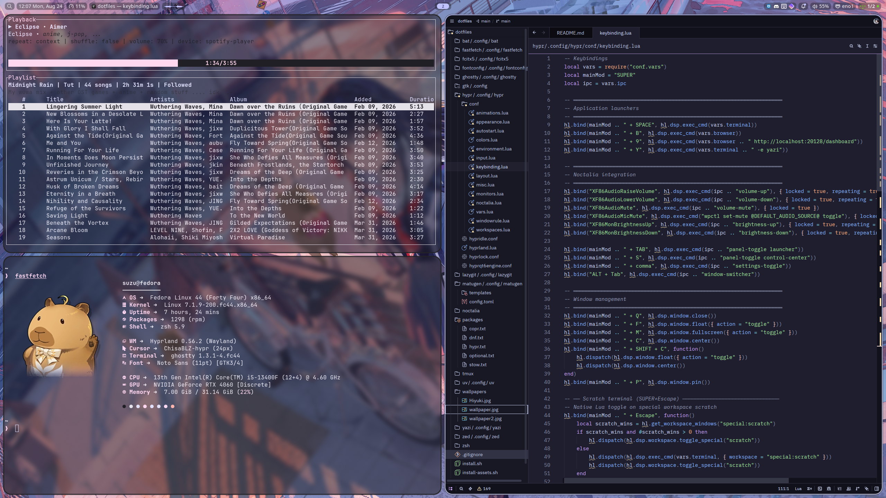

<div align="center">
    
# Tuturu's Dotfiles 
Home of all my dotfiles    
</div>

<p align="center">
  <a href="https://github.com/JustTuturu/dotfiles/commits">
    
  </a>
  <a href="https://github.com/JustTuturu/dotfiles/stargazers">
    
  </a>
  <a href="https://github.com/JustTuturu/dotfiles">
    
  </a>
</p>
<p><br/></p>

<p align="center">
  
</p>


## How to install

```bash
git clone https://github.com/JustTuturu/dotfiles.git ~/dotfiles
cd ~/dotfiles
./install.sh full
```

`install.sh full` handles packages (dnf, COPR, RPM Fusion), system optimizations, stows all configs, and prompts for optional applications. After the first Hyprland login, run the post-install asset step:

```bash
./install-assets.sh all
```

`install-assets.sh` installs JetBrains Mono Nerd Font, the Tela icon theme, the private cursor theme, Brave Browser, and Zed. Requires an authenticated `gh` CLI.

Log out and select **Hyprland** at login.

## Update dotfiles

My dotfiles are managed by [GNU Stow](https://www.gnu.org/software/stow/).
For some reason, `stow` is not installed by the script . Install it first.

```bash
sudo dnf install stow
``` 

Then run `stow` to symlink the dotfiles:

```bash
cd ~/dotfiles
./install.sh stow
```

## Softwares

- Terminal: [Ghostty](https://github.com/ghostty/ghostty)
- Font: [JetBrains Mono Nerd Font](https://github.com/ryanoasis/nerd-fonts) [Noto Sans Mono](https://github.com/googlefonts/noto-fonts)
- Colorscheme: [Matugen](https://github.com/JustTuturu/matugen)
- Shell: [Zsh](https://www.zsh.org/)
- Editor: [Zed](https://zed.dev/)
- Micro: terminal editor — **headless servers only** (`micro/.config/micro` with Matugen transparent theme; not used on the desktop, where Zed is the editor)

## Theming

Run matugen after changing wallpaper:

```bash
matugen image ~/Pictures/Wallpapers/Chisa.jpg --prefer darkness
```
