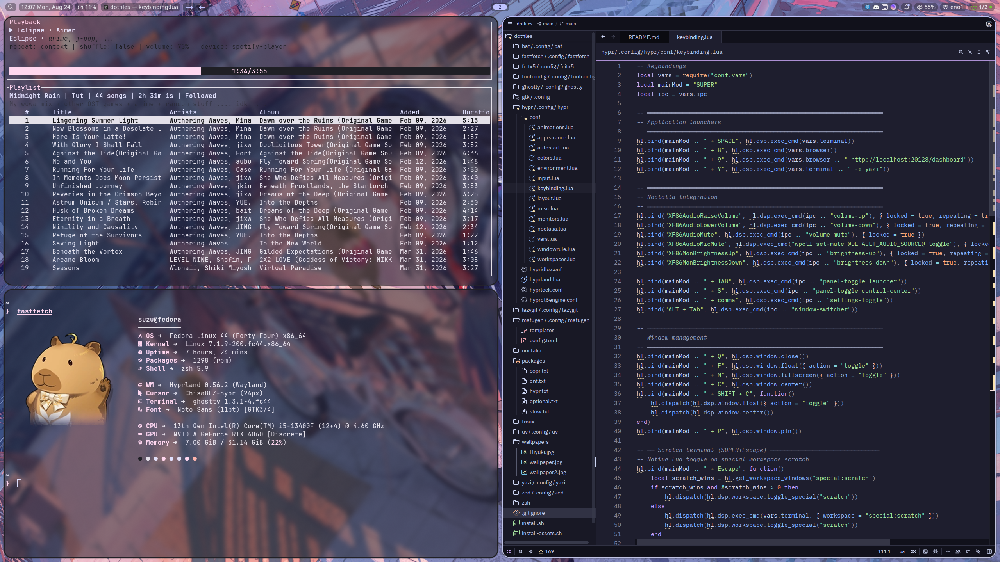

# Tuturu's Dotfiles



## Install

Fresh machine (no clone needed):

```bash
curl -fsSL https://raw.githubusercontent.com/JustTuturu/dotfiles/main/install.sh | bash
```

Or from a clone:

```bash
git clone https://github.com/JustTuturu/dotfiles.git ~/dotfiles
cd ~/dotfiles
./install.sh
```

Log out and select **Hyprland (uwsm-managed)** at login.

## Update

```bash
cd ~/dotfiles
./install.sh stow
```

## Software

- Terminal: [Ghostty](https://github.com/ghostty/ghostty)
- Shell: [Zsh](https://www.zsh.org/)
- Editor: [Zed](https://zed.dev/)
- Colorscheme: [Matugen](https://github.com/JustTuturu/matugen)

## Keybinds

`SUPER` is the Windows key.

| Keybind | Action |
| --- | --- |
| `SUPER + SPACE` | Terminal |
| `SUPER + B` | Browser |
| `SUPER + Y` | Yazi |
| `SUPER + TAB` | Launcher |
| `SUPER + Q` | Close window |
| `SUPER + Arrows` | Focus window |
| `SUPER + F` | Toggle floating |
| `SUPER + M` | Toggle fullscreen |
| `SUPER + SHIFT + S` | Area screenshot |
| `SUPER + L` | Lock |

## Theming

Wallpaper change (via Noctalia) regenerates all colors with matugen. To render manually:

```bash
matugen image ~/dotfiles/wallpapers/Chisa.jpg --prefer darkness
```
